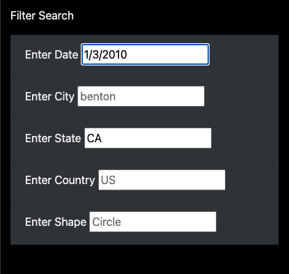

# UFOs

## Overview of Project: Explain the purpose of this analysis.
While utilizing JavaScript, HTML, and CSS, we are creating a website for Dana to help organize the data of UFO sightings. At first, we created a filtering system based on date, but now we're creating a more advanced filter. This filter will be able to search for multiple criteria simultaneously such as city, state, country, and shape.

## Results: Describe to Dana how someone might use the new webpage by walking her through the process of using the search criteria. Use images of your webpage during the filtering process to support your explanation.
Using the different filters, someone should be able to enter filter keywords and the site automatically filters through the data based on the data entered in the search bars. Pictured below is an example of the filter bar.

There is a bug in the code, so unfortunately it will not filter. In theory, however, whenever someone enters information such as a specific city with a specific date or country or other key, the filtering system will read through the data and populate entries based on the filtered data.

## Summary: In a summary statement, describe one drawback of this new design and two recommendations for further development.
One of the drawbacks of this new design is that it's not user friendly or intuitive. Usually, when a person looks to filter information out, there is a button to click or one can simply press enter. Based on this drawback, one recommendation for this is to install a button when the user is ready to filter through the results. Another recommendation that can be made is allowing new information to be added. If we look through the data.js, the data only goes up until 1/13/2010, which doesn't seem like enough data. Maybe if there is a way to extract (such as using web scraping) data from other websites about UFO sightings, then there would be a multitiude of data to back up Dana's thoughts on UFO sightings.
